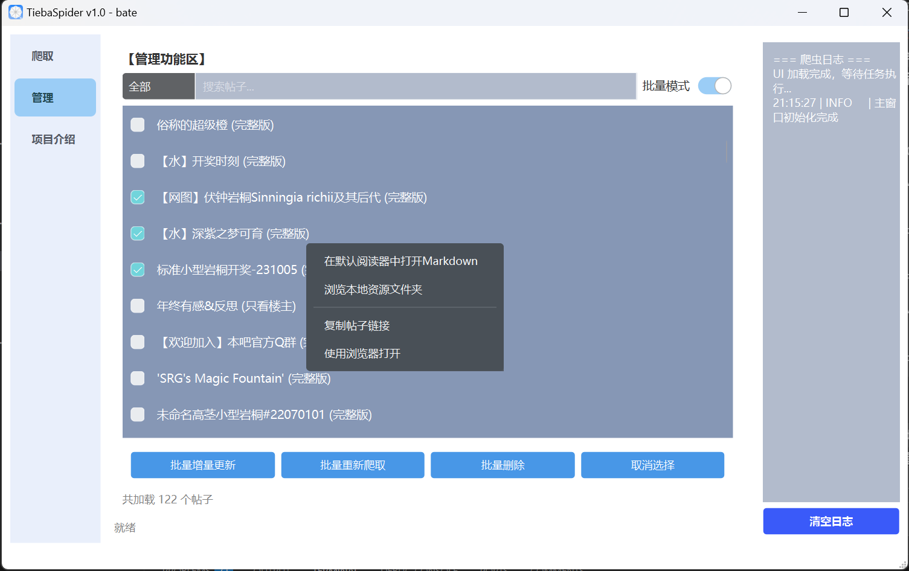
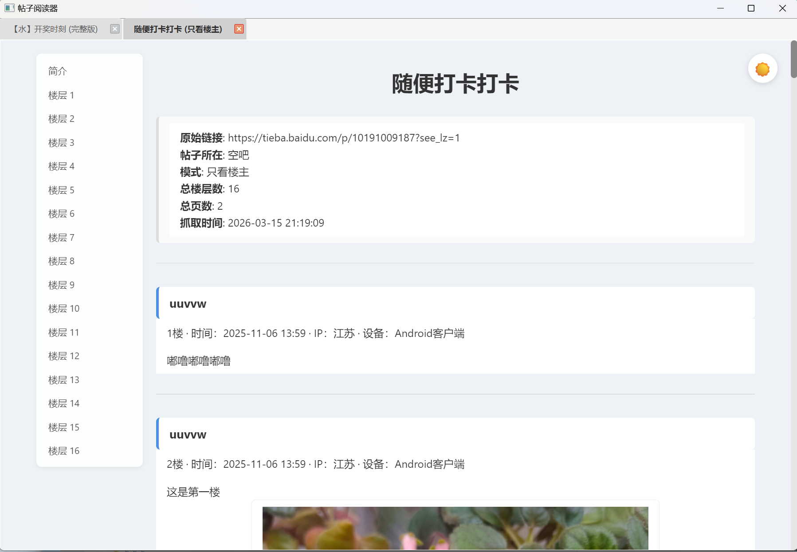
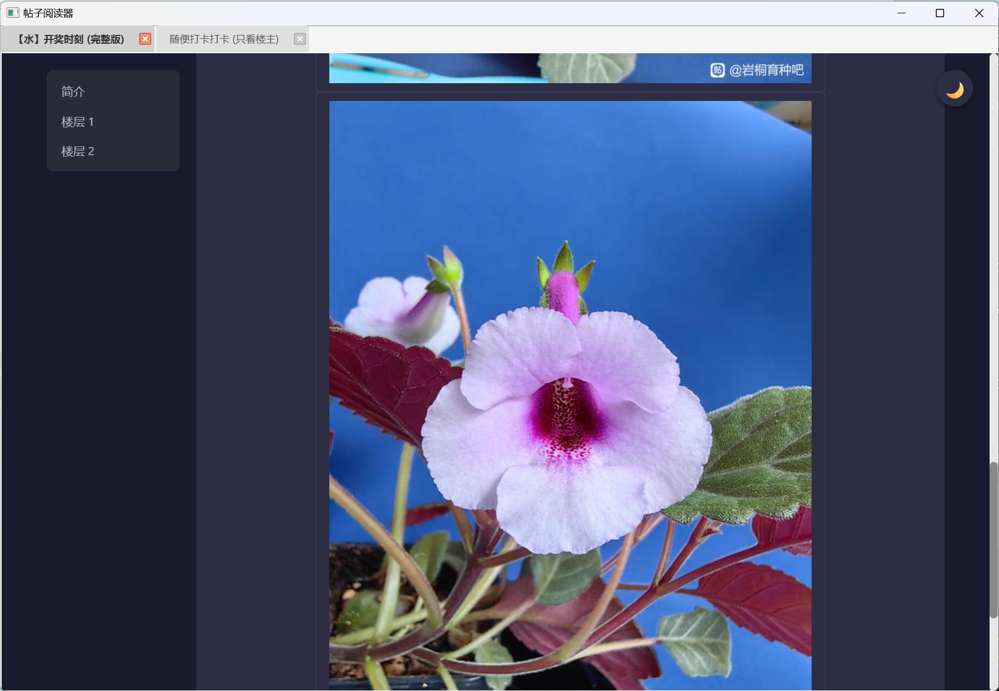
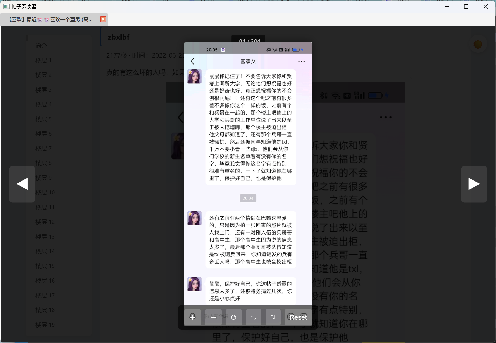

# Tieba Spider

一个用于将贴吧帖子保存到本地并提供离线浏览的工具。

当前状态：维护中（2026 年重构版）

---

## 截图预览

### 主界面


### 批量管理


### 勾选和菜单


### 日志输出


### 白天模式


### 夜间模式


### 图片浏览


---

## 功能

* 抓取帖子内容（楼层、用户、时间、IP 属地等）
* 转换为 Markdown 格式
* 本地存储与索引管理
* 增量更新与批量管理
* 支持只看楼主模式
* 内嵌 Chromium 渲染，实现离线浏览

---

## 存储结构

```text
data/
├── posts/       # 原始数据（JSON）
├── markdowns/   # 渲染用 Markdown
├── images/      # 图片资源
└── index.json   # 索引
```

---

## 设计

```text
aiotieba API → 数据解析 → 本地存储 → index → Markdown
```

支持智能增量更新、强制重新爬取、图片自动下载。

---

## 技术栈

* **后端核心**：[aiotieba](https://github.com/lumina37/aiotieba) - 贴吧 API 封装库
* **图片下载**：`asyncio` + `httpx`
* **界面框架**：`PySide6`
* **数据解析**：内置解析器

---

## 快速开始

在右侧 Release 中下载 `TiebaSpider.zip`，解压后运行 `TiebaSpider.exe` 即可。
所有爬取内容自动保存在程序目录下的 `data/` 文件夹，与`TiebaSpider.exe`同级。
请不要修改文件夹中的`TiebaSpider.exe`位置。建议在桌面创建`TiebaSpider`的快捷方式，方便使用和整体迁移。
如果你知道什么是🐭🐭饭，选择内置版本，否则选择纯净正式版。

---

## 本地部署

### 环境要求
* Python 3.11
* Windows 10/11

### 安装步骤
```bash
git clone https://github.com/xia-tian-wu/tieba-spider.git
cd tieba-spider
pip install -r requirements.txt
python main.py
```

### 打包为 exe
```bash
pyinstaller TiebaSpider.spec
```

生成文件在 `dist/` 目录。

---

## 使用教程

### 爬取单个帖子
1. 进入 **爬取** 页面
2. 粘贴贴吧帖子链接
3. 可选：开启 **只看楼主**
4. 点击 **开始爬取**

### 批量爬取
* 支持多行链接批量导入
* 自动去重，支持增量更新

### 管理已爬取帖子
* 单帖更新 / 重新爬取 / 删除
* 批量操作
* 搜索与筛选

---

## 配置说明

可在 `config.py` 调整延迟、重试、超时等策略，避免触发限制。

---

## 常见问题

* **Q：安全验证/拦截？**
  A：本项目基于 aiotieba 官方风格 API，拦截率已大幅降低。避免高频爬取即可。

* **Q：支持楼中楼吗？**
  A：当前版本暂不支持。

* **Q：图片下载失败？**
  A：链接过期、网络问题或反爬限制，可尝试重新爬取。

* **Q：可以多开吗？**
  A：不支持，单实例保护防止数据冲突。

---

## 许可证

MIT License

---

## 致谢

* 核心 API 支持：**[aiotieba](https://github.com/lumina37/aiotieba)** by lumina37
* AI 辅助开发：ChatGPT, Gemini, DeepSeek, Qwen, Doubao
* 开发者：xia-tian-wu

---

<div align="center">

如果这个项目对你有帮助，请给一个 ⭐ Star！

友情链接：[TiebaArchiver](https://github.com/Sorceresssis/TiebaArchiver)

</div>

