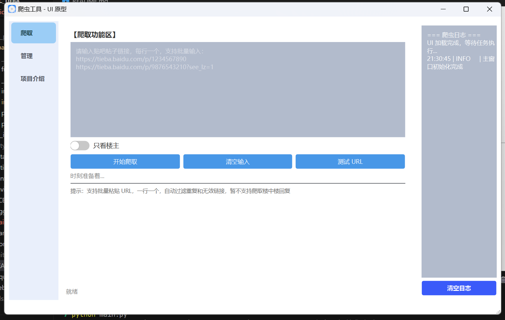
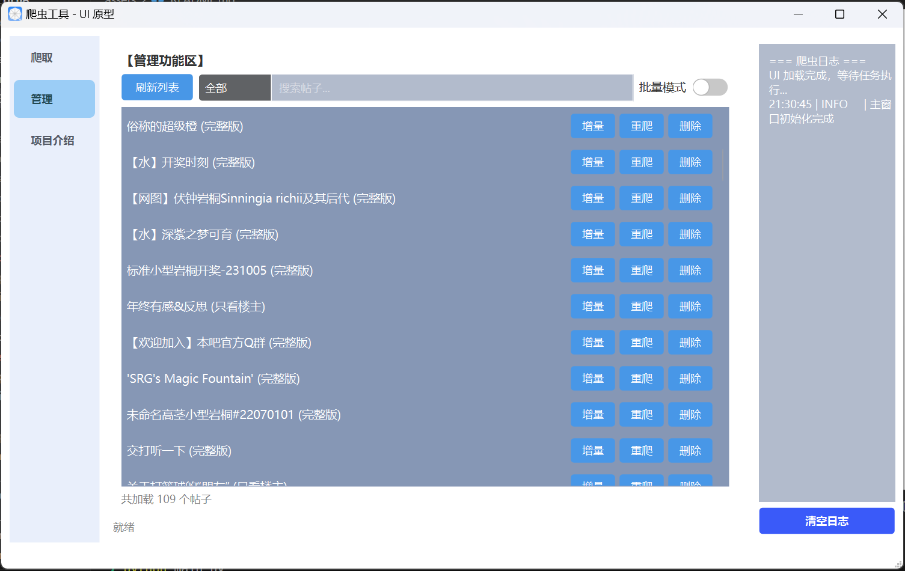
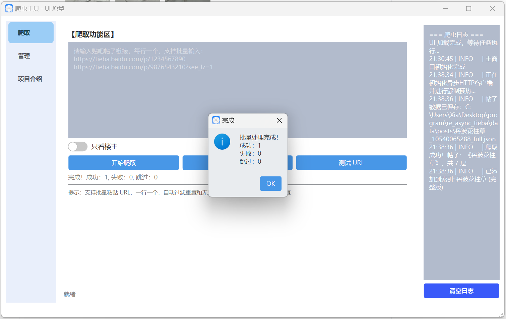

# TiebaSpider - 百度贴吧帖子爬取工具

一个简易的，基于 PySide6 的贴吧帖子爬取工具，支持完整爬取、增量更新、批量管理。

<div align="center">


[功能特性](#功能特性) • [快速开始](#快速开始) • [使用教程](#使用教程) • [常见问题](#常见问题)


</div>

---

## 截图预览

### 主界面





### 批量管理





### 日志输出




---

## 功能特性

### 核心功能

* **单帖爬取**：输入帖子链接，完整爬取所有楼层
* **批量爬取**：支持多链接同时爬取
* **增量更新**：智能检测新增楼层，避免重复爬取
* **只看楼主**：支持筛选楼主发言
* **图片下载**：自动下载帖子中的所有图片
* **Markdown格式**：自动生成格式化的 Markdown 文档

### 管理功能

* **帖子管理**：查看已爬取帖子列表
* **批量更新**：选中多个帖子一键更新
* **批量删除**：清理不需要的帖子数据
* **搜索过滤**：按标题、类型筛选帖子

### 技术特性

* **异步并发**：基于 asyncio + httpx，高效爬取
* **单实例保护**：防止多开导致数据冲突
* **详细日志**：实时显示爬取进度和错误信息
* **现代 UI**：基于 PySide6 的友好界面

---

## 快速开始

在右侧的release中选择 `TiebaSpider.zip`压缩包下载，解压，进入解压后文件夹，右键 `TiebaSpider.exe`选择在桌面创建快捷方式，随后点击快捷方式即可使用。爬取产生的帖子内容统一保存在解压后文件夹。

## 本地部署

### 环境要求

* Python 3.11
* Windows 10/11

### 安装步骤

#### 1. 克隆项目

```bash
git clone https://github.com/你的用户名/TiebaSpider.git
cd TiebaSpider
```

#### 2. 安装依赖

```bash
pip install -r requirements.txt
```

#### 3. 运行程序

```bash
python main.py
```

### 或者打包为可执行文件

```bash
# 使用 PyInstaller 打包
pyinstaller TiebaSpider.spec

# 生成的 exe 在 dist/ 目录下
```

---

## 📖 使用教程

### 爬取单个帖子

1. 点击左侧导航栏的 **爬取** 标签
2. 在输入框中粘贴贴吧帖子链接
3. （可选）开启 **只看楼主** 开关
4. 点击 **开始爬取** 按钮
5. 等待爬取完成，查看日志输出

### 批量爬取

1. 在输入框中粘贴多个链接（每行一个）
2. 点击 **开始爬取**
3. 如有重复链接，选择处理方式：

   * **忽略跳过**：跳过已存在的帖子
   * **更新爬取**：增量更新已有帖子

   ### 管理已爬取帖子
4. 点击左侧导航栏的 **管理** 标签
5. 查看已爬取的帖子列表
6. 可对单个帖子进行：

   * **增量更新**：检查并下载新楼层
   * **重新爬取**：完整重新爬取
   * **删除**：移除帖子数据
7. 开启 **批量模式** 可进行批量操作

   ---

   ## 📁 数据目录结构


   ```

   TiebaSpider/
   ├── data/                   # 数据目录（自动生成）
   │   ├── posts/              # JSON 格式的帖子数据
   │   ├── images/             # 下载的图片
   │   ├── markdowns/          # 导出的 Markdown 文件
   │   ├── index.json          # 帖子索引
   │   └── index.json.bak      # 备份
   │ 
   ├── assets/                 # 项目资源（截图等）
   ├── spider/                 # 爬虫核心模块
   ├── ui/                     # 界面模块
   ├── main.py                 # 程序入口
   └── requirements.txt        # 依赖列表
   ```
   ---

   ## ⚙️ 配置说明

   ### 延迟配置（防止被封禁）

   在 `config.py` 中可调整请求延迟：

   ```python
   delay_config = {
       'min_delay': 0.8,    # 最小延迟（秒）
       'max_delay': 3.0,    # 最大延迟（秒）
       'base_delay': 1.0,   # 基础延迟
       'jitter': True,      # 是否启用随机抖动
   }
   ```
   ### 重试配置

   ```python
   MAX_RETRIES = 5     # 最大重试次数
   TIMEOUT = 10        # 请求超时时间（秒）
   ```
   ---

   ## 常见问题

   ### Q: 爬取时遇到"百度安全验证"怎么办？

   A: 这是百度的反爬机制，建议：
8. 增加请求延迟（修改 `config.py`）
9. 暂停一段时间后再试
10. 避免短时间内大量爬取

    ### Q: 楼中楼（回复的回复）能爬取吗？

    A: 当前版本暂不支持楼中楼爬取。该功能需要额外的 API 接口分析，将在未来版本中考虑添加。

    ### Q: 图片下载失败怎么办？

    A: 可用选择重新爬取整个帖子。可能原因：
11. 图片链接已失效
12. 网络连接问题
13. 百度反爬限制

    ### Q: 可以同时运行多个程序吗？

    A: 不建议。程序有单实例保护，多开可能导致数据冲突。

    ---

    ## 许可证

    本项目采用 [MIT 许可证](LICENSE)

    ---

    ## 致谢

    这是一个完全由AI糊泥巴出来的项目，虽然有些晚，但至少对我够用了。

    AI：ChatGPT, Gemini, DeepSeek,Qwen, Doubao（贡献不分先后）

    人：xia-tian-wu

    ---


    <div align="center">

    ** 如果这个项目对你有帮助，请给一个 ⭐ Star！**

    友情链接：[TiebaArchiver](https://github.com/Sorceresssis/TiebaArchiver)

    如果希望用完全不丢失格式和楼中楼，贴吧表情等方式保存帖子，试试TiebaArchiver，不过部署, 配置和使用会稍微麻烦些。

    </div>
